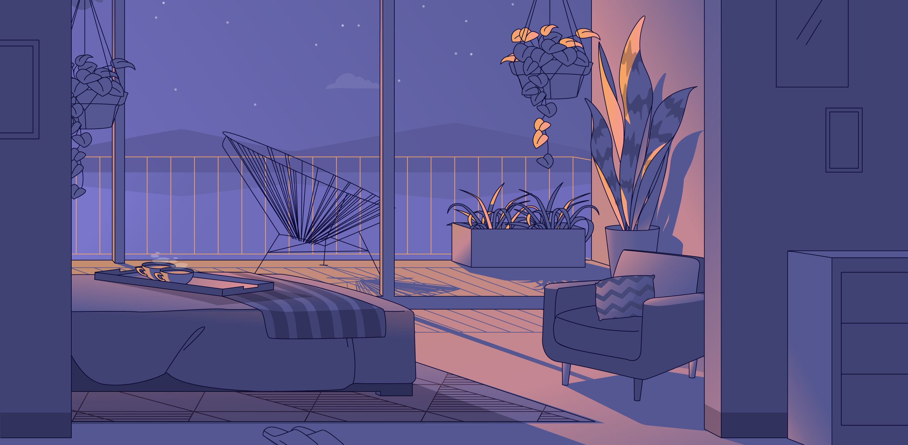

<h1 align="center">Olá! Eu sou Gabriel Silveira 👋</h1>

  

  
  

 

## 💻 Quem sou?   
Sou um Desenvolvedor Full Stack com foco em UX/UI, apaixonado por criar interfaces e aplicações inovadoras! Atualmente estudo desenvolvimento Full Stack pela [Growdev](https://www.growdev.com.br/), e complemento meus estudos na [B7Web](https://alunos.b7web.com.br/) e [Origamid](https://www.origamid.com/).

Já concluí projetos de UX/UI Design e continuo aprimorando minhas habilidades, agora com Design Gráfico, para construir uma base mais sólida.  

Gosto muito de me desafiar saindo da minha zona de conforto, e é isso que me motiva a sempre me aventurar em novas tecnologias!  

---

## 🧠 Hard Skills   
&nbsp;
&nbsp;
&nbsp;
&nbsp;
&nbsp;
&nbsp;
&nbsp;
&nbsp;
&nbsp;
&nbsp;
&nbsp;
&nbsp;
&nbsp;
&nbsp;
&nbsp;  

---

## ⚙️ Futuras Skills   
&nbsp;
&nbsp;
&nbsp;
&nbsp;
&nbsp;
&nbsp;

---

## 🛸 O que faço no meu tempo livre?   
- Amo passar meu tempo livre com minha namorada e família  
- Gosto de aprender mais sobre música e história  
- Adoro viajar, assistir futebol, filmes e séries  

--- 

  

